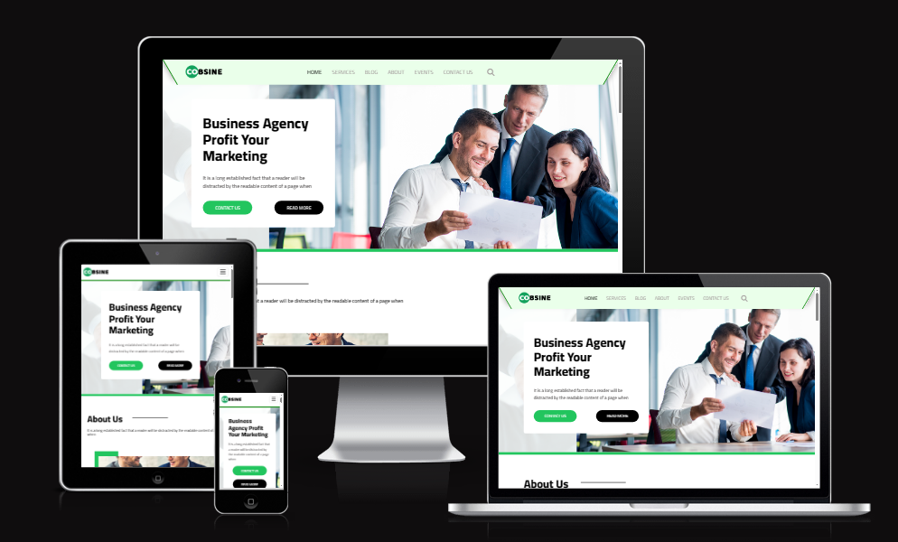

# **Cobsine Business Portfolio Website**

**Cobsine Business Portfolio Website** is a fully responsive, visually appealing business portfolio website designed to showcase your products, services, or business in a professional manner. Built using HTML, CSS, and JavaScript, this website provides a modern, user-friendly experience with a clean and polished design for a powerful online presence.

## **Features**

- 🌍 **Responsive Design**: The website adapts seamlessly to all screen sizes, whether on desktop, tablet, or mobile, ensuring an optimal user experience on any device.

- 🎨 **Modern UI/UX**: A minimalist and elegant design focused on usability and aesthetics, with interactive elements that make navigating the site easy and intuitive.

- 🏢 **Business Showcase Sections**: Dedicated sections for showcasing your services, products, or projects. Easily highlight what you offer with images, descriptions, and call-to-action buttons to engage visitors.

- 👥 **About Us Page**: A section to introduce your team, your mission, and the philosophy behind your business. Share your story to build trust and connect with potential clients.

- 📬 **Contact Form**: An integrated contact form that allows visitors to easily reach out for inquiries, support, or collaboration. This can be customized to fit your needs.

- ✨ **Smooth Animations**: Subtle animations and transitions that enhance the user experience without being overwhelming, adding a modern touch to the site.

- 🔍 **SEO Optimized**: The website structure is optimized for search engines, increasing the likelihood of being discovered by potential customers.

## **Technologies Used**

- **HTML5**: For structuring the website's content.
- **CSS3**: For styling and ensuring a responsive, visually appealing design.
- **JavaScript**: For interactivity, including smooth scrolling, form validation, and animations.
- **Bootstrap** (optional): Used for responsive design and quick prototyping.

## **Installation**

To get started with the **Cobsine Business Portfolio Website**, follow these steps:

1. Clone the repository to your local machine:
   ```bash
   git clone https://github.com/Momen9Sarsour/Cobsine-Business-Portfolio-Website.git
   ```

2. Navigate to the project directory:
   ```bash
   cd Cobsine-Business-Portfolio-Website
   ```

3. Open the `index.html` file in your browser to view the website locally.

4. Optionally, you can deploy the website to a live server using services like GitHub Pages, Netlify, or Vercel.

## **Customization**

You can easily customize the website to fit your branding and needs:

- Update the **text content** in the HTML files to reflect your services, team, or mission.
- Replace the **images** with high-quality photos relevant to your business. (Modify the image paths as needed.)
- Customize the **color scheme** by modifying the CSS file to match your brand colors.
- Modify the **contact form** to link to your preferred email or server endpoint for handling form submissions.

## **Project Images**

You can add images to showcase your project here. For example, add screenshots of the site or images of the services you provide. Make sure to replace the image paths with your own.

- 📸 **Website Screenshot**:
  

## **Live Demo**

You can view the live demo of the website using the link below:

[Live Demo of Website](https://example.com)

---

### **Example Usage**
Whether you are a **freelancer** looking to showcase your portfolio, a **startup** building your online presence, or a **small business** looking to attract more clients, the **Cobsine Business Portfolio Website** offers the perfect foundation to launch your site quickly and professionally.

---

## 👤 About Me

**Momen Sarsour — Computer Systems Engineering**  
📧 Email: **momensarsour5@gmail.com**  
📱 WhatsApp: **+970567077179**
